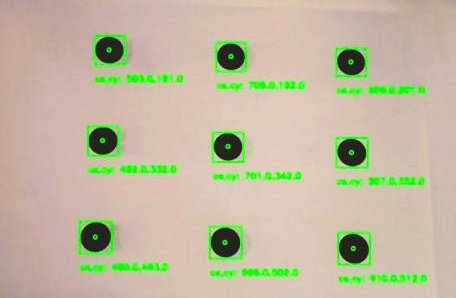
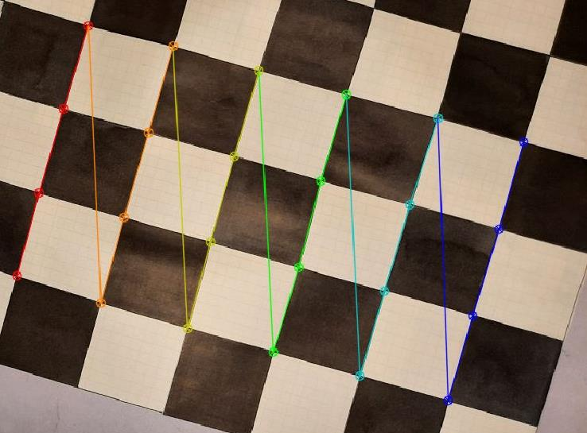

# Object Centre-of-Mass Detection

Find the centre of objects in a camera image, then convert that pixel position into real-world (X, Y, Z) coordinates in centimetres.

A camera looks straight down at a flat work surface. The program compares each frame to an empty background, finds the outline of every object, and computes its centre from image moments. With the camera calibrated, it then maps that centre from pixels (u, v) into world coordinates, so a robot arm or other machine can use it as a target.

This is my final project (CK) for the Image Processing course, 2023. The full write-up (in Vietnamese) is in [`reports/49_NguyenHuyenTrang_20020727.pdf`](reports/49_NguyenHuyenTrang_20020727.pdf).

## Example

Nine dark discs on a white sheet, 50 cm below the camera. Each object gets a green bounding box, a dot at its centre, and its pixel centre `cx,cy`:



*From Figure 11 of the report, flipped vertically so the labels read the right way up (the camera was mounted upside down).*

These detected pixel centres were then paired with hand-measured positions on the board (in `initial_perspective_calibration.py`) to compute the pixel→world transform:

| Point | Pixel (u, v) | World X, Y (cm) | Distance to lens d* (cm) |
|---|---|---|---|
| 1 | (502, 185) | (5.5, 3.9) | 46.8 |
| 2 | (700, 197) | (14.2, 3.9) | 47.0 |
| 3 | (894, 208) | (22.8, 3.9) | 47.4 |
| 4 | (491, 331) | (5.5, 10.6) | 44.2 |
| 5 | (695, 342) | (14.2, 10.6) | 43.8 |
| 6 | (896, 353) | (22.8, 10.6) | 44.8 |
| 7 | (478, 487) | (5.5, 17.3) | 43.0 |
| 8 | (691, 497) | (14.2, 17.3) | 42.5 |
| 9 | (900, 508) | (22.8, 17.3) | 44.4 |

The report measured about **2% error** for flat objects. Error rose to about 15% when an object's height was more than ¼ of its width or length.

## How it works

1. **Camera calibration.** Photos of a chessboard give the camera matrix and lens distortion coefficients (`cv2.calibrateCamera`).

   

2. **Perspective calibration.** Known world points and their pixel positions give the camera's rotation and translation (`cv2.solvePnP`) and a scaling factor *s*.
3. **Object detection.** For each frame:
   - convert the frame and the background to grayscale
   - take the absolute difference, then apply a Gaussian blur
   - threshold with Otsu's method
   - find the external contours
   - discard noise: area outside 900–90 000 px, aspect ratio outside 1:5–5:1, or touching the image edge
4. **Centre of mass.** For each remaining contour, `cx = M10 / M00` and `cy = M01 / M00` (`cv2.moments`).
5. **Pixel to world.** Compute `XYZ = R⁻¹ · (K⁻¹ · s · [u, v, 1]ᵀ − t)`, where K is the new camera matrix, R the rotation matrix, t the translation vector and s the scaling factor.

## Project structure

| Path | Purpose |
|---|---|
| `image_recognition.py` | Background subtraction, Otsu threshold, contour filtering, centre (moments) and drawing |
| `camera_xyz.py` | Loads calibration data, runs detection and converts pixel centres to world X, Y, Z |
| `initial_camera_calibration.py` | Step 1: chessboard calibration → `camera_data/cam_mtx.npy`, `dist.npy`, `newcam_mtx.npy`, `roi.npy` |
| `initial_perspective_calibration.py` | Step 2: solvePnP from measured points → `rvec1`, `tvec1`, `R_mtx`, `Rt`, `P_mtx`, `s_arr` |
| `mainloop.py` | Live loop on a Raspberry Pi camera: warm-up, background capture, detection |
| `main.py` | Entry point that starts the live loop |
| `connectCamera.py` | Optional: preview an Android phone camera through the IP Webcam app |
| `calibration_images/` | 56 chessboard photos (1280×720) used for calibration |
| `calib_results/` | Screenshots of the detected chessboard corners |
| `camera_data/`, `camera_data2/` | Saved calibration matrices |
| `inputs/` | Sample photos of objects on the work surface |
| `reports/` | Project report (PDF) |

## Requirements

- Python 3.8+
- `opencv-python`, `numpy`
- For the live loop: a Raspberry Pi with the camera enabled (`sudo raspi-config` → Interface Options → Camera) and `picamera`
- For `connectCamera.py` only: `requests` and `imutils`

```bash
pip install opencv-python numpy
pip install picamera          # on the Raspberry Pi only
pip install requests imutils  # only for connectCamera.py
```

## Usage

### 1. Calibrate the camera

Print a chessboard with **5 cm squares** and **4 × 6 inner corners**. Take at least 10 photos of it (56 were used here) at different positions and angles, from the camera you'll use. Resize them to 1280×720 and put them in `calibration_images/`. Then run:

```bash
python initial_camera_calibration.py
```

Each image is shown with its detected corners. The script prints the camera matrix and distortion coefficients and saves them in `camera_data/`.

### 2. Calibrate the perspective

1. Fix the camera above the work surface (about 50 cm here).
2. Place markers at 9 known points.
3. Measure each point's X, Y (cm) and its straight-line distance d* to the lens.
4. Write the measurements into `worldPoints` and the detected pixel centres into `imagePoints` in `initial_perspective_calibration.py`. Set `writeValues = True` and run:

```bash
python initial_perspective_calibration.py
```

It saves `rvec1.npy`, `tvec1.npy`, `R_mtx.npy`, `Rt.npy`, `P_mtx.npy` and `s_arr.npy` to `camera_data/`. It also prints each point's scaling factor and its error from the mean.

> On the first run these files don't exist yet. The script creates a `camera_XYZ()` at the top, which tries to load them, so comment out that line (and set `calculatefromCam = False`) until the files are saved.

### 3. Run live detection (Raspberry Pi)

```bash
python main.py
```

- The first ~50 frames show **"Warming Up"**. The next frame becomes the background, so **keep the surface empty until "background captured" is printed**.
- Place objects in view. Each one gets a box, a centre dot, its pixel centre `cx,cy` and its world position `X,Y`.
- **Space** saves the current frame to `imgdir` (set in `main.py`). **Esc** quits.

### Detect centres in a single image (no Pi needed)

`image_recognition.py` works on its own. Use one photo of the empty surface and one with objects, taken from the same camera position:

```python
import cv2
import image_recognition

rec = image_recognition.image_recognition(print_status=False, preview_images=False)

background = cv2.imread("background.jpg")   # empty surface
scene = cv2.imread("scene.jpg")             # same view, with objects

count, points, output = rec.run_detection(scene, background)

for x, y, w, h, cx, cy in points:
    print(f"object at box ({x}, {y}, {w}x{h}), centre ({cx}, {cy})")

cv2.imwrite("result.jpg", output)
```

On a 1280×720 test scene with a disc centred at (500, 200) and a rectangle centred at (850, 435), it prints:

```
object at box (798, 398, 105x75), centre (850, 435)
object at box (459, 159, 83x83), centre (500, 200)
```

The size limits (`MIN_AREA`, `MAX_AREA`) and `OtsuSensitivity` are tuned for 1280×720 images, so change them in `image_recognition.py` for other resolutions or object sizes.

## Known issues

- `camera_xyz.py` imports `image_recognition_singlecam`, but the file in this repo is `image_recognition.py`. Change the import (or rename the file) before running `main.py` or `initial_perspective_calibration.py`.
- `main.py` calls `mainloop.capturefromPiCamera(...)` on the module. It should create the class first: `mainloop.main_loop().capturefromPiCamera(...)`.
- `camera_data/` only contains the step 1 files. Run step 2 with `writeValues = True` before using world coordinates.
- Some paths use Windows-style backslashes (for example `"\inputs/"`) or Raspberry Pi paths (`/home/pi/Desktop/Captures/`). Adjust them for your machine.
- Taller objects (height > ¼ of their footprint) give larger errors, because the method assumes objects lie flat on the surface.

## References

- OpenCV tutorial: [Camera Calibration](https://docs.opencv.org/4.x/dc/dbb/tutorial_py_calibration.html)
- A. Gahramanova, *Locating Centers of Mass with Image Processing*, DOI: 10.5038/2326-3652.10.1.4906
- B. K. P. Horn, *Robot Vision*, MIT Press, 1986
- K. Demaagd, A. Oliver, *Practical Computer Vision with SimpleCV*, O'Reilly, 2012

## License

Released under the [MIT License](LICENSE).
